# GitHub Workflows Documentation

This document describes the automated workflows used in this repository.

## 📋 Available Workflows

### 1. CI Workflow (`ci.yml`)
**Trigger**: Push and Pull Requests

Validates the Helm chart on every code change:
- Lints the chart using `helm lint`
- Runs chart testing with `ct lint`
- Validates template rendering
- Ensures chart quality and best practices

### 2. Release Workflow (`release.yml`)
**Trigger**: Push to `main` branch (when Chart.yaml version changes)

Automates chart releases:
- Creates GitHub releases
- Signs the chart with GPG
- Publishes to GitHub Pages (Helm repository)
- Updates Artifact Hub

### 3. Auto-Update Versions (`update-valkey-version.yml`)
**Trigger**:
- Weekly schedule (Mondays at 9:00 AM UTC)
- Manual dispatch

Automatically keeps Valkey and redis-exporter versions up-to-date:

#### How It Works

```mermaid
graph TD
    A[Scheduled: Every Monday] --> B[Pull cgr.dev/chainguard/valkey:latest]
    C[Manual Trigger] --> B
    B --> D[Detect Valkey version]
    D --> E{Version changed?}
    E -->|No| F[✓ No action needed]
    E -->|Yes| G[Update Chart.yaml appVersion]
    G --> H[Bump chart patch version]
    H --> I[Update CHANGELOG.md]
    I --> J[Create Pull Request]
    J --> K[Review & Merge]
    K --> L[Release workflow triggers]
```



#### What It Does

1. **Version Detection**
   - **Valkey**: Pulls `cgr.dev/chainguard/valkey:latest` and runs `--version`
   - **Redis-exporter**: Queries GitHub API for latest `oliver006/redis_exporter` release
   - Compares both with current versions in chart files

2. **If Any Version Changed**
   - **Valkey update**: Updates `appVersion` in `Chart.yaml`
   - **Exporter update**: Updates `values.yaml`, `values.schema.json`, and `Chart.yaml` annotations
   - Bumps the chart patch version (e.g., `0.2.0` → `0.2.1`)
   - Adds entry to `CHANGELOG.md` with version changes
   - Creates a pull request with all changes

3. **Pull Request Contents**
   - Dynamic title based on what updated:
     - `chore: update Valkey to X.Y.Z` (Valkey only)
     - `chore: update redis-exporter to X.Y.Z` (exporter only)
     - `chore: update Valkey and redis-exporter` (both)
   - Detailed body with old → new version info for each component
   - Labeled as `automated`, `version-update`, `dependencies`
   - Ready for review and merge

4. **After Merge**
   - Release workflow automatically triggers
   - New chart version is published
   - Users get the updated version

#### Manual Trigger

You can manually trigger the workflow from GitHub:

1. Go to **Actions** tab
2. Select **Update Valkey Version** workflow
3. Click **Run workflow**
4. Select branch (usually `main`)

This is useful when you want to check for updates immediately instead of waiting for the weekly schedule.

#### Why This Approach?

**Benefits:**
- ✅ Chart stays current with latest Valkey and redis-exporter releases
- ✅ Security updates are tracked and applied quickly
- ✅ Full transparency via pull requests
- ✅ Human review before changes are published
- ✅ Automatic changelog maintenance
- ✅ Both core application and metrics tooling kept in sync

**Trade-offs:**
- ⚠️ Chainguard free tier only provides `latest` tag
- ⚠️ Updates are reactive (weekly check) not instant
- ⚠️ Requires manual PR merge (by design, for safety)

## 🔧 Maintenance

### Adjusting Update Frequency

Edit the cron schedule in `update-valkey-version.yml`:

```yaml
schedule:
  - cron: '0 9 * * 1'  # Every Monday at 9:00 AM UTC
```

Common schedules:
- Daily: `'0 9 * * *'`
- Twice a week: `'0 9 * * 1,4'` (Monday and Thursday)
- Monthly: `'0 9 1 * *'` (First day of month)

### Troubleshooting

**If version detection fails:**
1. Check Docker pull permissions for Chainguard registry
2. Verify the `--version` command output format hasn't changed
3. Review workflow logs in Actions tab

**If PRs aren't being created:**
1. Ensure GitHub Actions has write permissions
2. Check if there's already an open PR for version update
3. Verify the comparison logic in the workflow

## 📚 References

- [Chainguard Images](https://www.chainguard.dev/chainguard-images)
- [Helm Chart Best Practices](https://helm.sh/docs/chart_best_practices/)
- [GitHub Actions Documentation](https://docs.github.com/en/actions)
